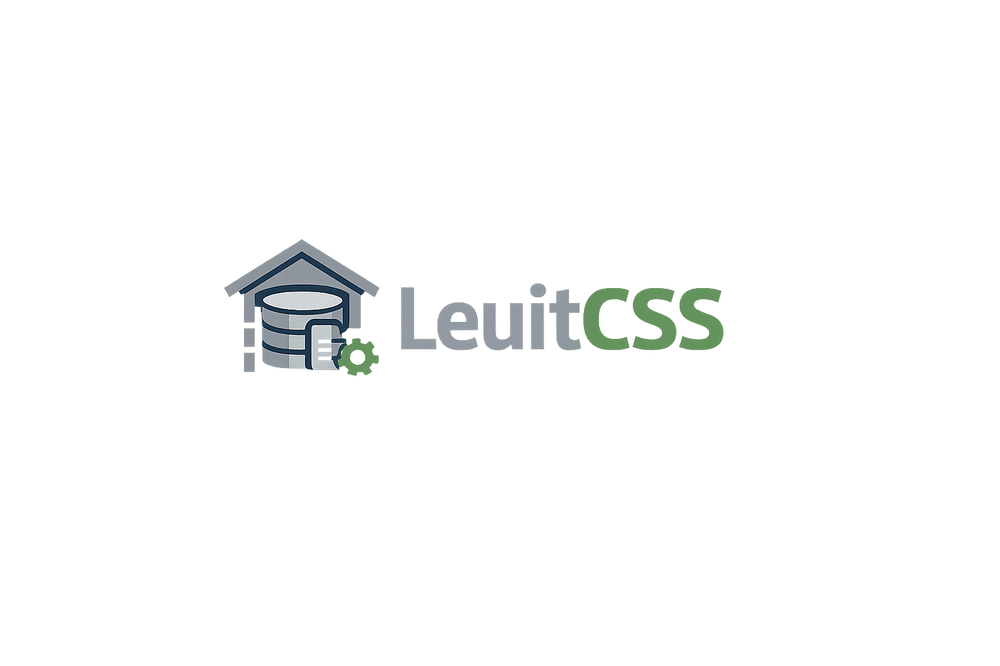
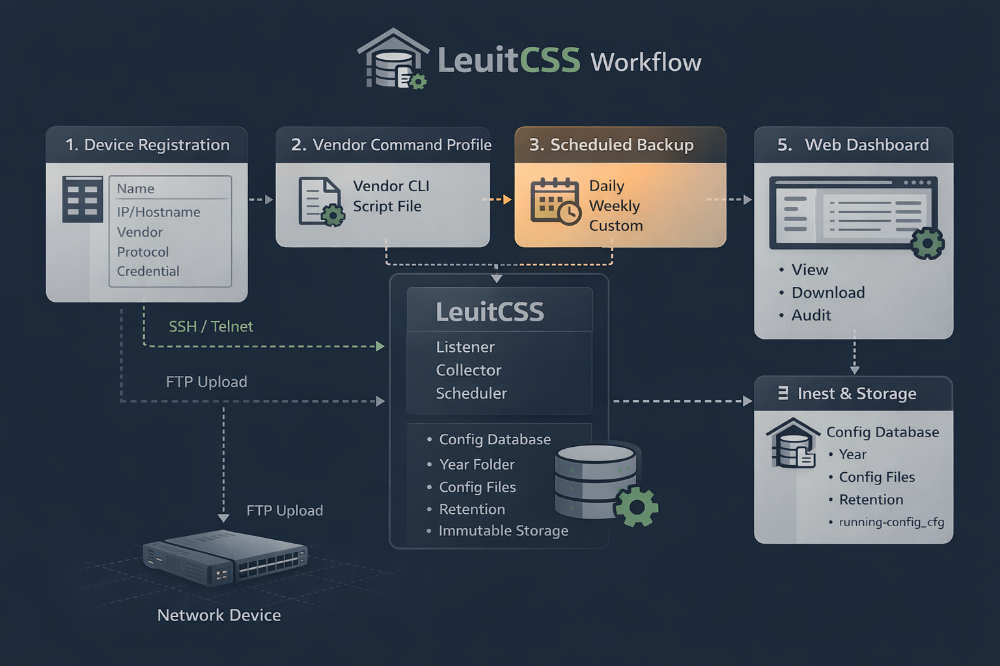

# LeuitCSS
**Leuit Config Storage System**

  

---

## 🇮🇩 Kenapa Namanya LeuitCSS?

**Leuit** adalah lumbung penyimpanan dalam budaya Sunda.

Leuit bukan tempat bekerja setiap hari.  
Leuit adalah tempat **menyimpan hasil kerja**, dijaga dengan tenang,
dan dibuka **saat benar-benar dibutuhkan**:
- saat pemulihan
- saat audit
- saat memastikan keberlanjutan sistem

Filosofi ini digunakan untuk menggambarkan peran LeuitCSS.

Konfigurasi jaringan adalah **aset paling kritikal** dalam operasi infrastruktur.
Ia tidak seharusnya diedit sembarangan, dipush otomatis,
atau dijadikan objek eksperimen harian.

**LeuitCSS memposisikan konfigurasi sebagai hasil kerja yang disimpan,
bukan sebagai objek eksekusi.**

CSS (**Config Storage System**) menegaskan bahwa LeuitCSS adalah sebuah **sistem**,
bukan script, bukan fitur tambahan, dan bukan sekadar backup tool.

> **LeuitCSS adalah lumbung konfigurasi —  
> tempat menyimpan keadaan yang sah, bukan tempat mengeksekusi perubahan.**

---

## 🇬🇧 Why the Name LeuitCSS?

**Leuit** refers to a traditional storage barn in Sundanese culture.

A Leuit is not used for daily work.
It is a place to **store results**, carefully guarded,
and opened only when truly needed:
- during recovery
- during audits
- to ensure long-term sustainability

This philosophy defines LeuitCSS.

Network configurations are **critical operational assets**.
They should not be casually edited, automatically pushed,
or treated as daily workspaces.

**LeuitCSS treats configuration as stored state,
not as an execution target.**

CSS (**Config Storage System**) emphasizes that LeuitCSS is a **system**,
not a script, feature, or simple backup tool.

---

## 🇮🇩 Apa itu LeuitCSS?

LeuitCSS adalah sistem penyimpanan konfigurasi perangkat jaringan
yang dirancang sebagai **source of truth**.

LeuitCSS tidak melakukan eksekusi,
tidak melakukan auto-push,
dan tidak menggantikan keputusan engineer.

Fungsi utamanya:
- mengambil konfigurasi perangkat jaringan secara aman
- menyimpan konfigurasi secara immutable
- menyediakan referensi terpercaya untuk audit dan pemulihan

---

## 🇬🇧 What is LeuitCSS?

LeuitCSS is a configuration storage system for network devices,
designed to act as a **source of truth**.

It does not execute changes,
does not push configurations,
and does not replace human decision-making.

Its primary role is to:
- securely collect configurations
- store configurations immutably
- provide reliable references for audits and recovery

---

## 🧠 Design Principles

- **Immutable by design**  
  Configurations are never overwritten.

- **Human-centric recovery**  
  Recovery decisions are made by humans, not automation.

- **Read-only interaction**  
  The system provides read and download access only.

- **Clear system boundary**  
  LeuitCSS stores state; other systems execute.

- **Safety over automation**  
  Stability and clarity come before aggressive automation.

---

## 🔁 Workflow Overview

  

**Ringkas:**
1. LeuitCSS login ke device via SSH/Telnet (read-only)
2. Konfigurasi diambil sesuai profil vendor
3. Device upload config via FTP (akun terpisah)
4. Config divalidasi & disimpan secara immutable
5. Engineer mengakses via Web UI

---

## 🧭 Position in Iyankz and Brother Ecosystem

- **GETOLS** → execution & provisioning  
- **LeuitCSS** → configuration storage (source of truth)  
- **LeuitLog** → audit & event logging  
- **PingTD** → network visibility & diagnostics  
- **SemarDNS** → DNS resolver & policy  
- **BotLinkMaster** → optical power & SFP status checks  

Each system has a **clear, non-overlapping responsibility**.

---

## 🚧 Project Status

LeuitCSS is currently in **pre-release** stage.

Current focus:
- concept and architecture finalization
- documentation and workflow definition
- strict boundary enforcement

Not intended for production use yet.

---

## 🧾 Documents

- Whitepaper: `releases/LeuitCSS_Whitepaper.pdf`
- System Blueprint: `releases/LeuitCSS_Blueprint.pdf`

---

## Penutup / Closing

LeuitCSS is not built to replace engineers.  
It is built to ensure that every technical decision
has a clear, safe, and trusted configuration foundation.

© Iyankz and Brother
